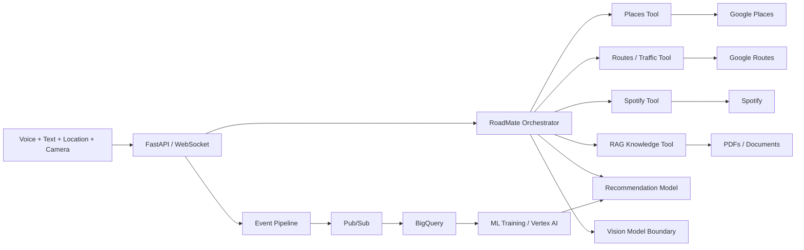

# RoadMate AI — Multimodal Agentic Mobility Assistant

RoadMate AI is an advanced AI engineering project that combines **real-time voice + text conversation, location intelligence, routing, recommendations, RAG, ML, music controls, data engineering, observability and cloud deployment** in one system.

The goal is not to create another chatbot. The goal is to build a personal assistant that can understand a request, decide which tools or models are needed, execute them, combine the results and respond naturally by text and voice.

## Example conversations

- “Find waterfalls near me and rank the best three.”
- “Find Indian food close to my current route.”
- “Route me there and tell me if traffic makes another route faster.”
- “Play relaxing music.”
- “What does this road sign mean?”
- “Search my uploaded driver handbook and explain the rule with evidence.”
- “What places do I usually prefer around this time of day?”

## What makes this advanced

RoadMate is organized as a real AI platform with independent tool/model boundaries:



## Core AI capabilities

### 1. Natural voice + text conversation
The included browser app already supports microphone input, typed chat and spoken responses. The production architecture is ready for Gemini Live so audio/video/text can share a persistent real-time session.

### 2. Agent/tool orchestration
The orchestrator classifies requests and invokes the appropriate tools. Tool interfaces are kept separate from conversation logic so the local fallback can later be replaced by Gemini function calling or Google ADK without rewriting the integrations.

### 3. Nearby-place intelligence
Google Places integration can search restaurants, waterfalls, parks, coffee, fuel and other POIs using the user's coordinates. A recommendation layer ranks results instead of returning raw API order.

### 4. Traffic-aware routing
Google Routes integration computes driving/walking/bicycle routes. Driving requests use a traffic-aware routing preference when live credentials are configured.

### 5. RAG document assistant
Upload a PDF/text document and query it through `/v1/rag/query`. The local implementation uses TF-IDF retrieval for a zero-cloud demo; the architecture supports replacing it with embeddings/vector search in production.

### 6. Recommendation ML
The repo includes a supervised place-selection training pipeline. Real interaction events can replace the synthetic dataset and train a personalized ranker using distance, ratings, reviews, availability, time, preference and context features.

### 7. Computer-vision boundary
RoadMate is designed to accept road-sign/signal observations from a separate vision model (YOLO/CNN/TFLite). This is explicitly an awareness/education feature and never an authoritative driving controller. See [`docs/SAFETY.md`](docs/SAFETY.md).

### 8. Music control
Spotify integration supports search and playback-control integration points. OAuth/user permissions are intentionally externalized instead of committing tokens.

### 9. Data engineering + MLOps
Structured agent events are written locally and designed to stream through Pub/Sub into BigQuery. This creates training/evaluation data for recommendation, ETA, intent and quality models.

## Repository layout

```text
Road_Friend/
├── app/
│   ├── agents/           orchestrator
│   ├── integrations/     Places, Routes, Spotify
│   ├── rag/              document retrieval
│   ├── ml/               online ranking logic
│   ├── data/             event collection
│   └── web/              voice + text browser client
├── ml/                    offline model training
├── sql/                   BigQuery analytics schema
├── terraform/             GCP infrastructure
├── tests/                 unit tests
├── docs/                  architecture + safety
├── Dockerfile
└── docker-compose.yml
```

## Run locally

```bash
git clone https://github.com/Jashwanth248/Road_Friend.git
cd Road_Friend
python -m venv .venv
source .venv/bin/activate
pip install -r requirements-dev.txt
pytest -q
uvicorn app.main:app --reload --port 8080
```

Open `http://localhost:8080`, allow browser location/microphone access, and use either the text box or **Talk** button.

No API key is required for the local demo; external tools return safe demo results when credentials are absent.

## Connected mode

Set environment variables locally (never commit secrets):

```text
GOOGLE_MAPS_API_KEY=...
GEMINI_API_KEY=...
SPOTIFY_ACCESS_TOKEN=...
```

Then restart the API. Places and Routes become live immediately. The included voice UI remains local; `GEMINI_API_KEY` is reserved for the production Gemini Live connector described in the architecture.

## API surface

- `POST /v1/chat` — text/tool orchestration
- `WS /ws/assistant` — low-latency conversational channel
- `POST /v1/route` — traffic-aware routing integration
- `POST /v1/rag/ingest` — PDF/text ingestion
- `POST /v1/rag/query` — grounded retrieval
- `GET /metrics` — Prometheus metrics
- `GET /healthz` — health check

## ML roadmap implemented in the architecture

| Model | Purpose | Current state |
|---|---|---|
| Gradient-boosted place ranker | personalized POI ranking | training pipeline included |
| ETA model | learn residual travel-time corrections | event/data design ready |
| CNN/YOLO road perception | road-sign/signal recognition | integration boundary + safety policy |
| Intent classifier | low-cost request routing | orchestrator data ready |
| Foundation model | open-ended conversation/tool calling | Gemini Live integration seam |

## Production cloud design

Terraform enables the core GCP services and provisions Artifact Registry, Pub/Sub and BigQuery. A production deployment can run the FastAPI service on Cloud Run or GKE and use Vertex AI for training/serving.

## Engineering principles

- **Tools over hallucination:** location and route facts come from deterministic/external systems.
- **Model separation:** recommendation, perception and conversation models have independent interfaces.
- **Observable agents:** every tool call can become a structured event.
- **Privacy by design:** precise location, documents and OAuth tokens should remain protected and minimally retained.
- **Safety boundary:** perception assists awareness; it does not control driving decisions.
- **Runnable without cloud:** reviewers can launch the UI/API before configuring paid services.

## Next production upgrades

- direct Gemini Live bidirectional audio/video bridge
- Google ADK tool registration and memory
- Vertex AI Vector Search / AlloyDB pgvector RAG
- Pub/Sub producer + Dataflow streaming transforms
- BigQuery feature tables and dbt models
- XGBoost personalization from real event data
- YOLO road-sign model + TensorFlow Lite mobile export
- offline/edge mode for degraded connectivity
- Android/Flutter client with Navigation SDK
- OAuth 2.0 account linking for Spotify
- OpenTelemetry traces and model/tool quality dashboards
