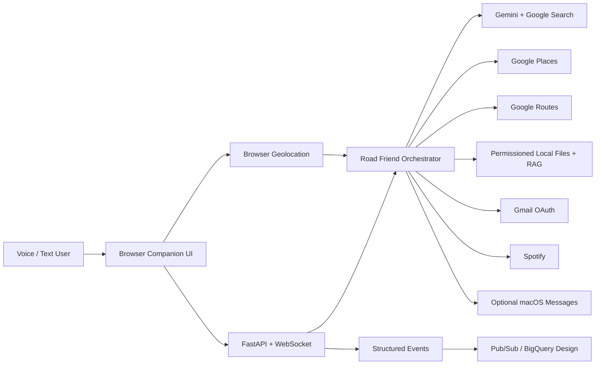

# Road Friend — Personal AI Companion

Road Friend is a local-first, voice + text personal AI companion. It combines current web answers, Google Maps location intelligence, traffic-aware routing, selected-file document understanding, Gmail, Spotify, optional macOS Messages, RAG, ML, data engineering, and cloud-ready integrations behind one conversational interface.

The design goal is simple: **talk naturally, let the agent choose the right tool, and require permission before private access or external actions.**

## What it can do

- Talk with you by voice or text.
- Run in **Hands Free** mode: listen → answer → speak → listen again.
- Answer open-ended questions with Gemini.
- Ground current-information questions with Google Search.
- Ask for browser location permission and find real nearby places.
- Remember the places it just listed so “take me to the first one” works.
- Calculate traffic-aware driving routes with Google Routes.
- Read only the local PDF/Word/Excel/PowerPoint/CSV/text files you explicitly choose.
- Use RAG to answer follow-up questions from those documents.
- Connect Gmail with Google OAuth, summarize recent messages, and search mail.
- Require a separate confirmation before every outgoing email.
- Search/control Spotify when OAuth/token configuration is available.
- Optionally send a macOS Messages/iMessage message after a one-time confirmation.
- Record structured interaction events for later analytics/ML work.

## Permission model

Road Friend does **not** crawl your Mac, inbox, camera, or accounts automatically.

| Capability | Behavior |
|---|---|
| Location | Browser asks permission; coordinates are shared only while enabled |
| Local files | Road Friend asks first, then opens the browser file picker; only selected files are read |
| Gmail read | Road Friend asks permission for the session, then Google OAuth controls account authorization |
| Email send | Confirmation required for every send |
| macOS Messages send | Confirmation required for every send; integration is off by default |
| Camera | Not enabled by default |
| Driving perception | Advisory only; never an authoritative go/stop controller |

See [`docs/PERMISSIONS.md`](docs/PERMISSIONS.md).

## Architecture



## Run locally on Mac

```bash
git clone https://github.com/Jashwanth248/Road_Friend.git
cd Road_Friend

python3 -m venv .venv
source .venv/bin/activate

pip install -r requirements-dev.txt
uvicorn app.main:app --reload --port 8080
```

Open:

```text
http://localhost:8080
```

For the best current browser speech-recognition support on macOS, use current Chrome.

## Configure live AI + Maps

Create a local `.env`:

```text
GEMINI_API_KEY=your_key
GOOGLE_MAPS_API_KEY=your_key
GEMINI_MODEL=gemini-3.6-flash
```

Enable in Google Cloud:

- Places API (New)
- Routes API

Never commit `.env` or credentials.

## Connect Gmail

1. Enable the Gmail API in a Google Cloud project.
2. Configure the Google OAuth consent screen.
3. Create an **OAuth Desktop app** client.
4. Download the OAuth client JSON.
5. Save it locally in the repo as `credentials.json`.
6. Start Road Friend.
7. Click **Connect Gmail**, or say “check my Gmail” and approve the permission request.
8. Google opens an OAuth consent flow in your browser.
9. A local `token.json` is created after authorization.

Both `credentials.json` and `token.json` are ignored by Git.

## Example conversation

```text
You: Hey Road Friend, what happened in AI news today?
Road Friend: [Gemini + Google Search grounded spoken answer]

You: Find a quiet coffee place near me.
Road Friend: I need your location. Would you like to enable location?
[Enable Location]

You: Find the best coffee near me.
Road Friend: 1... 2... 3...

You: Take me to the second one.
Road Friend: The traffic-aware route is ...

You: Read my resume.
Road Friend: May I open a file picker so you can choose the document?
You: Yes.
[file picker opens]

You: What experience in that resume is most relevant to an AI engineer role?
Road Friend: [RAG answer from the selected resume]

You: Check my latest emails.
Road Friend: May I access Gmail for this session?
You: Yes.
[OAuth if needed]
Road Friend: [summarizes recent mail]

You: Send an email to person@example.com saying I will call tomorrow.
Road Friend: I prepared the email. Should I send it?
You: Yes.
Road Friend: Sent.
```

## Main APIs

- `POST /v1/chat`
- `WS /ws/assistant`
- `POST /v1/route`
- `POST /v1/files/ingest`
- `POST /v1/rag/query`
- `POST /v1/integrations/gmail/connect`
- `GET /v1/integrations/gmail/status`
- `GET /v1/capabilities`
- `GET /metrics`
- `GET /healthz`

## Current limits

- Voice uses browser speech recognition + browser text-to-speech. It supports hands-free turn taking, but native Gemini Live audio streaming is a separate next step.
- Gmail requires your own OAuth Desktop credentials.
- Reading arbitrary local files without a picker is intentionally not supported.
- macOS Messages sending is optional and disabled by default.
- iMessage/SMS reading is not enabled because macOS protects the Messages database and unrestricted access would require broader OS permissions.
- Road-sign/signal AI remains advisory only and must not make driving decisions.

## Next production upgrades

- Native Gemini Live bidirectional audio/video streaming
- Google Calendar + Contacts OAuth tools
- real Spotify OAuth account linking
- map visualization and route polyline UI
- Android/Flutter mobile client with Navigation SDK
- Vertex AI Vector Search / pgvector document memory
- encrypted long-term user preference memory
- OpenTelemetry traces for model/tool calls
- Pub/Sub → Dataflow → BigQuery event pipeline
- trained XGBoost place recommender
- optional YOLO/TFLite road-awareness model
